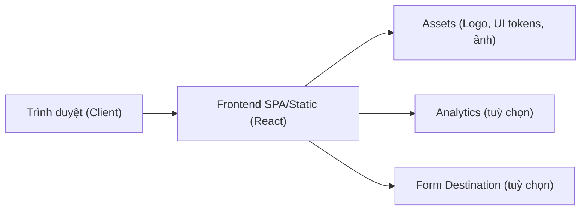
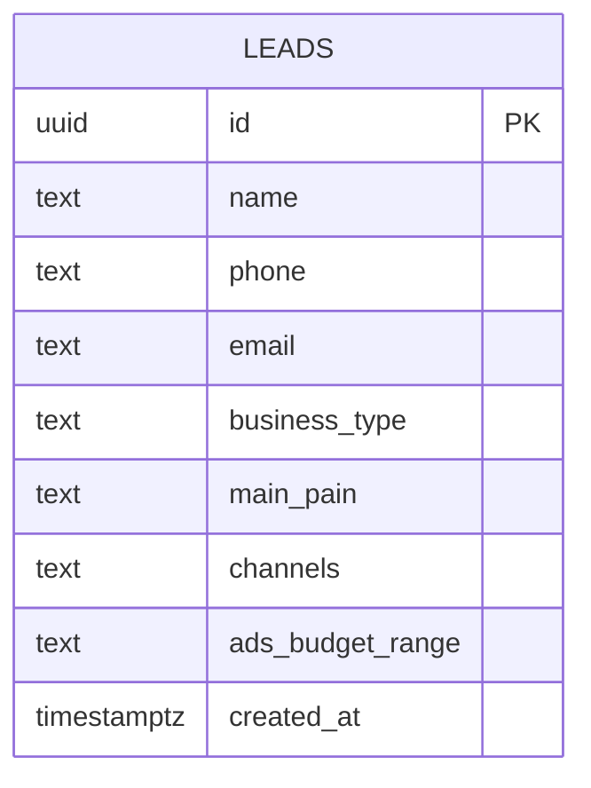

## 1. Thiết Kế Kiến Trúc
Landing page thuần frontend (static-first), có form thu lead theo 2 mức:
- Mức 1 (mặc định): mở kênh liên hệ (Zalo/Email) + lưu sự kiện analytics.
- Mức 2 (tuỳ chọn sau): gửi form sang endpoint (Supabase/Sheets/CRM) khi bạn cung cấp nơi nhận dữ liệu.

## 2. Mô Tả Công Nghệ
- Frontend: React@18 + TypeScript + Vite
- Styling: TailwindCSS@3 + CSS variables (để bám UI kit và dễ tinh chỉnh theme)
- Motion: Framer Motion (chỉ nếu cần animation phức tạp; nếu không sẽ ưu tiên CSS animation để nhẹ)
- Routing: react-router (2 route: / và /thanks) hoặc cấu trúc multi-page tuỳ cách deploy
- Triển khai: build tĩnh (Netlify/Vercel/Cloudflare Pages hoặc server tĩnh bất kỳ)

## 3. Định Nghĩa Route
| Route | Mục đích |
|---|---|
| / | Landing page chính |
| /thanks | Trang cảm ơn sau CTA/form |

## 4. Định Nghĩa API (nếu có backend)
MVP không cần backend.

Nếu bạn muốn “gửi form về hệ thống”, sẽ bổ sung 1 endpoint:
- `POST /api/leads`
  - Request (gợi ý):
    - `name: string`
    - `phone?: string`
    - `email?: string`
    - `businessType?: string`
    - `mainPain?: string`
    - `channels?: string[]`
    - `adsBudgetRange?: string`
  - Response:
    - `ok: boolean`
    - `leadId?: string`

## 5. Mô Hình Dữ Liệu (nếu lưu trữ)
MVP không lưu DB.

Nếu dùng DB (ví dụ Supabase/Postgres), 1 bảng là đủ:

## 6. Cấu Trúc Thư Mục (dự kiến)
- `src/pages/Home`
- `src/pages/Thanks`
- `src/sections/*` (Hero, Problem, SixTasks, HowItWorks, UseCase, Customize, Compare, CTA)
- `src/components/*` (Button, Card, Badge, Navbar, Footer)
- `src/theme/*` (tokens màu, type scale, shadows, radii)
- `public/*` (logo, og-image, favicon)

## 7. Yêu Cầu Phi Chức Năng
- Performance: LCP < 2.5s trên mạng 4G (ảnh tối ưu, preload font hợp lý)
- SEO cơ bản: title/description, OG meta, sitemap (nếu deploy domain chính thức)
- Accessibility: contrast đúng, focus ring rõ, keyboard navigable
- i18n: nội dung mặc định tiếng Việt; có thể thêm EN sau bằng file JSON

