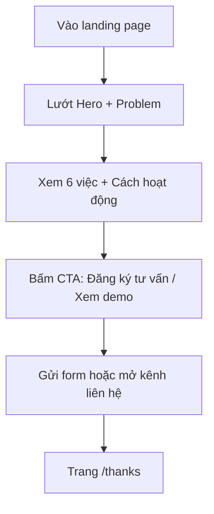

## 1. Tổng Quan Sản Phẩm
Landing page giới thiệu ViralMinds (dịch vụ/giải pháp “agent marketing / AI workforce cho marketing”), tập trung giúp khách hàng hiểu giá trị trong 30 giây và chuyển đổi sang đăng ký tư vấn/demo.
- Mục tiêu: truyền tải định vị + giải thích cách hoạt động + chứng minh khác biệt + thúc đẩy CTA.
- Đối tượng chính: chủ doanh nghiệp SME / người vận hành marketing (F&B, spa, shop, DTC, coworking, local business) và nhóm doanh nghiệp muốn “AI hoá” quy trình marketing theo hệ thống.

## 2. Tính Năng Cốt Lõi

### 2.1 Vai Trò Người Dùng
Không phân vai trong sản phẩm (landing page). Người dùng là khách truy cập.

### 2.2 Module/Trang Cần Có
1. **Landing page (/)**
2. **Trang cảm ơn (/thanks)** (sau khi bấm gửi form hoặc bấm CTA; có thể tối giản)

### 2.3 Chi Tiết Tính Năng Theo Trang
| Tên trang | Module | Mô tả chức năng |
|---|---|---|
| / | Header | Logo + menu cuộn tới section + CTA “Đăng ký tư vấn” (sticky khi cuộn) |
| / | Hero | Định vị 1 câu + mô tả ngắn + 2 CTA + minh hoạ “workforce pipeline” dạng motion |
| / | Pain / Problem | Nêu đúng “nỗi mệt” của chủ business: thiếu người chạy hết vòng marketing |
| / | “ViralMinds là gì?” | Chốt định nghĩa: 1 agent làm việc thay team (không phải chatbot/công cụ gợi ý) |
| / | 6 Việc ViralMinds làm | 6 thẻ (Research, Content, Distribution, Ads, Analytics, Community/CRM) có hover + icon |
| / | Cách hoạt động | Flow 5 bước: Hiểu doanh nghiệp → Xác định việc → Specialist phối hợp → Con người kiểm soát → Đo lường & tối ưu |
| / | Demo / Use case | “Một mục tiêu → ra cả quy trình”: mô phỏng đầu vào (mục tiêu) và đầu ra (lịch + bài + ads + báo cáo) |
| / | Cá nhân hoá | Giải thích ViralMinds “nhớ brand / khu vực / giọng / cái gì ra đơn”, không dùng cấu hình chung |
| / | Vì sao khác | So sánh nhanh: Freelancer / Agency / ChatGPT / ViralMinds |
| / | Quy trình triển khai | 2 bước: Consulting → Setup (nhấn mạnh: không cài, không học, người vẫn kiểm soát) |
| / | CTA cuối | Form lead + nút liên hệ nhanh (Zalo/Email) + cam kết “chưa duyệt thì chưa đăng/chưa chi ads” |
| /thanks | Thông báo | Xác nhận đã nhận thông tin + hướng dẫn bước tiếp theo + nút quay lại |

## 3. Luồng Trải Nghiệm Cốt Lõi
Luồng chính: người dùng vào landing → đọc 2–3 section đầu → hiểu định vị → bấm CTA → điền form/nhấp liên hệ → tới trang cảm ơn.

## 4. Thiết Kế Giao Diện

### 4.1 Định Hướng Thiết Kế (theo UI Kit được cung cấp)
- Tinh thần thị giác: “futuristic dashboard / editorial tech” (nền tối, chữ sáng, nhấn bằng màu ấm và trạng thái hệ thống).
- Typography (khớp UI kit):
  - Display/Heading: Cabin (Medium/Bold)
  - Body: Mulish/Muli (Regular/Medium)
  - Mono/label: IBM Plex Mono (cho tag, số liệu, nhãn)
- Màu chủ đạo (trích từ UI kit):
  - Nền tối: #0B0D12 (đề xuất; tinh chỉnh theo logo sau khi tối ưu asset)
  - Text chính: #FFFFFF
  - Accent vàng: #F8D489 (nhấn CTA, highlight từ khoá)
  - Trạng thái “OK”: #7B9A55
  - Trạng thái “Alert”: #E46C3D
- Style thành phần:
  - Card: bo góc vừa (12–16), border mảnh có độ trong (glass/outline), có highlight khi hover
  - Button: primary dùng accent vàng + shadow mềm; secondary dạng outline
  - Background: gradient tối nhẹ + noise/film grain tinh tế + các “panel line” gợi UI dashboard
- Motion:
  - Hero load: stagger reveal (heading → subheading → CTA → mô phỏng workflow)
  - Hover micro: card nâng nhẹ + glow accent
  - Scroll: section title xuất hiện theo viewport (không quá dày đặc)

### 4.2 Bố Cục Nội Dung (Copy Draft)
| Section | Tiêu đề gợi ý | Nội dung chính (bản nháp) | CTA/Action |
|---|---|---|---|
| Hero | “Một agent marketing làm việc thay team.” | Bạn nói mục tiêu kinh doanh. ViralMinds làm. Bạn duyệt. Việc ra thị trường. | Primary: “Đăng ký tư vấn” / Secondary: “Xem ViralMinds hoạt động” |
| Problem | “Cái mệt không phải thiếu ý tưởng.” | Mệt vì không có ai chạy hết vòng: research → content → đăng → ads → đo số → chăm khách. | “Tôi đang mệt vì…” (scroll tới form với lựa chọn) |
| Định nghĩa | “Không phải chatbot. Không phải công cụ gợi ý.” | ViralMinds đưa việc đã xong: lịch tuần, bài sẵn đăng, hướng ads sẵn duyệt, báo cáo sẵn đọc. | “Xem 6 việc” |
| 6 việc | “Sáu việc bạn vẫn phải thuê người.” | Research/Strategy, Content, Distribution, Ads, Analytics, Community/CRM. | “Chọn 1 việc muốn bỏ khỏi đầu” |
| How it works | “Con người vẫn kiểm soát.” | Chưa duyệt thì chưa đăng. Chưa duyệt thì chưa chi ads. | “Đặt lịch demo 20 phút” |
| Use case | “Một mục tiêu → ra cả quy trình.” | Ví dụ: “Ra mắt sản phẩm mới trong tháng này” → ViralMinds xuất các đầu ra tương ứng theo pipeline. | “Xem demo” |
| Cá nhân hoá | “Mỗi doanh nghiệp một Workforce.” | ViralMinds học brand knowledge, khu vực, giọng, lịch sử cái gì ra đơn. | “Bắt đầu từ Consulting” |
| So sánh | “Khác agency/freelancer/ChatGPT ở chỗ…” | Agency đẹp slide, chậm việc; freelancer làm một khâu; ChatGPT trả lời; ViralMinds giao việc đã xong và chạy cả vòng. | “Đăng ký tư vấn” |
| Triển khai | “Bạn không cần cài gì.” | 2 bước: Consulting → Setup. Chi phí mô hình AI theo nhu cầu (nếu áp dụng). | “Liên hệ ViralMinds” |
| CTA cuối | “Việc marketing nào đang làm bạn mất ngủ nhất?” | Form: tên, ngành, kênh đang chạy, vấn đề số 1, ngân sách ads (tuỳ chọn). | Submit + kênh liên hệ nhanh |

### 4.3 Responsiveness
- Desktop-first; breakpoint rõ: 1280/1024/768/375.
- Mobile: hero rút gọn, CTA cố định dạng bottom bar, card chuyển sang carousel/stack.
- Tối ưu touch: tap target ≥ 44px; hạn chế hover-only.

## 5. Nội Dung Cần Bổ Sung (từ phía ViralMinds để hoàn thiện landing)
- Link liên hệ chính (Zalo/Email/Calendly) và thông tin công ty (địa chỉ/đăng ký nếu cần).
  - Zalo: https://zalo.me/0374149427 (hoặc hiển thị số: 0374149427)
- “Demo” là video ngắn hoặc animation mô phỏng (nếu có file demo, gửi kèm).
- 3–5 case study hoặc số liệu (nếu có): trước/sau, KPI, timeline.
- FAQ ngắn (nếu muốn tăng chuyển đổi), gợi ý:
  - “Có cần cài đặt gì không?”
  - “Thời gian tư vấn/demo ban đầu bao lâu và mục tiêu buổi này là gì?”
  - “Sau tư vấn/demo thì bước tiếp theo là gì?”
  - “Chi phí như thế nào?”
  - “Bảo mật dữ liệu ra sao?”
